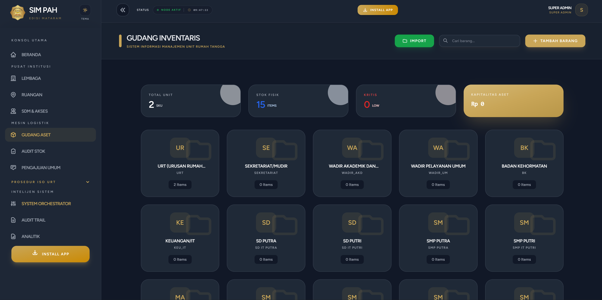

# SIM URT PAH - Mataram  
**Sistem Informasi Manajemen Pondok Pesantren Abu Hurairah Mataram**  
(ISO 9001:2015 Compliant – Developed with Vibe Coding Methodology)

  

## Project Overview

SIM URT PAH - Mataram adalah sistem informasi manajemen lengkap yang dikembangkan untuk Pondok Pesantren Abu Hurairah Mataram, melayani 28 lembaga internal dalam pengelolaan kebutuhan rumah tangga (air, listrik, sabun pel lantai, dll), pengajuan, laporan, inventori, dan prosedur sesuai standar **ISO 9001:2015**.

Sistem ini berhasil dibangun dalam **hanya 7 hari** oleh satu developer menggunakan metodologi **Vibe Coding** — pendekatan kolaborasi manusia-AI di mana AI berperan sebagai *partner* development yang kuat, bukan pengganti, dengan pengawasan ketat manusia melalui MCP, schema engineering, dan tech stack terstruktur.

**Highlight Utama (Metrics dari Pengembangan):**
- Total waktu: 7 hari (vs estimasi konvensional 3–6 bulan)
- Kode AI-generated: 70–85% secara keseluruhan (90–100% di fase terstruktur)
- Total Lines of Code (LOC): ~37,875 (tanpa vendor/dependencies)
- Git Commits: 45
- Database Migrations: 66
- Custom Files: 250+ (controllers, models, Vue components)
- ISO Modules/Procedures: 39
- Activity Logs (Audit Trail): 184
- Total Prompts ke AI: ~45

Proyek ini menjadi studi kasus utama dalam paper:  
**"Evaluating Vibe Coding as an AI-Orchestrated Development Methodology: A Case Study on Accelerating Complex Web-Based Educational Management Systems"**  
(ID: 6823, sedang direvisi di *International Journal of Software Engineering and Computer Science – IJSECS*).

## Fitur Utama

- Multi-tenancy dengan filter institution_id
- Role-Based Access Control (RBAC): Admin (URT) vs Karyawan (per lembaga)
- CRUD lengkap untuk item, pengajuan, laporan, inventori
- Sistem request dengan upload gambar & approval workflow
- Modul prosedur ISO 9001:2015 (documented information, monitoring, nonconformity)
- Reporting & dashboard interaktif
- Audit trail lengkap menggunakan Spatie Laravel Activitylog
- Mobile-responsive UI (Tailwind CSS + Vue 3)

## Tech Stack

| Komponen          | Teknologi                          | Catatan                                      |
|-------------------|------------------------------------|----------------------------------------------|
| Backend           | Laravel 12                         | Framework utama, opinionated structure       |
| Frontend          | Vue 3 + Inertia.js                 | SPA tanpa Filament (manual coding)           |
| Database          | MySQL                              | Managed via migrations                       |
| Styling           | Tailwind CSS                       | Primary color: #C9A658                       |
| Authentication    | Laravel Breeze                     | Customized login dengan searchable dropdown  |
| Activity Logging  | spatie/laravel-activitylog         | Audit trail untuk setiap aksi model          |
| AI Assistance     | Cursor + Model Context Protocol    | Rules.md untuk kontrol output AI             |

**Catatan Penting**: Tidak menggunakan Filament atau package admin panel lain — semua CRUD dan dashboard dibuat manual untuk kontrol maksimal.

## Installation

### Prerequisites

- PHP ≥ 8.2
- Composer
- Node.js ≥ 18 & npm
- MySQL/MariaDB

### Langkah Instalasi

1. Clone repository
   ```bash
   git clone https://github.com/iqbaladiatma/sim-pah.git
   cd sim-pah
   ```

2. Install dependencies
   ```bash
   composer install
   npm install
   ```

3. Copy environment file
   ```bash
   cp .env.example .env
   ```

4. Generate app key
   ```bash
   php artisan key:generate
   ```

5. Konfigurasi .env (database, APP_URL, dll)

6. Jalankan migrasi & seed (jika ada)
   ```bash
   php artisan migrate --seed
   ```

7. Compile assets
   ```bash
   npm run dev
   # atau npm run build untuk production
   ```

8. Jalankan server
   ```bash
   php artisan serve
   ```

Akses aplikasi di: http://localhost:8000

## Penggunaan

1. Login menggunakan kredensial lembaga (dropdown searchable untuk pilihan lembaga).
2. Role Admin (URT Division): Kelola semua lembaga.
3. Role Karyawan: Hanya akses pengajuan & laporan lembaga sendiri.
4. Upload gambar disimpan di public/storage/reports.

## Vibe Coding Methodology
Proyek ini dikembangkan menggunakan Vibe Coding — framework 3-pilar:
1. Context Persistence → MCP + rules.md (persistent rules untuk hindari context loss)
2. Schema Engineering → ERD & workflow didefinisikan dulu sebelum generate kode
3. Conditional Tech Stack → Pilih Laravel untuk struktur opinionated & dokumentasi lengkap

Detail metodologi, metrics, dan hasil tersedia dalam paper (sedang revisi di IJSECS).

## Open Science & Reproducibility

- **Source Code**: Public di GitHub dengan struktur rapi
- **License**: MIT (lihat file LICENSE)
- **Data & Artifacts**: ERD, schema, prompt logs, MCP rules.md tersedia di folder /docs
- **Citation** (untuk paper atau penggunaan kode):
  ```bibtex
  @misc{iqbal2026simpah,
    author       = {Iqbal Muhammad Adiatma},
    title        = {SIM URT PAH - Mataram: Vibe Coding MIS Implementation},
    year         = {2026},
    publisher    = {GitHub},
    howpublished = {\url{https://github.com/iqbaladiatma/sim-pah}}
  }
  ```

## Kontribusi & Kontak
Feel free to open issues, fork, atau pull request jika ingin berkontribusi.

**Kontak:**
- Author: Iqbal Muhammad Adiatma
- Email: iqbalmuhammadadiatma@gmail.com

Terima kasih telah mengunjungi repo ini! Semangat Vibe Coding! 🚀
